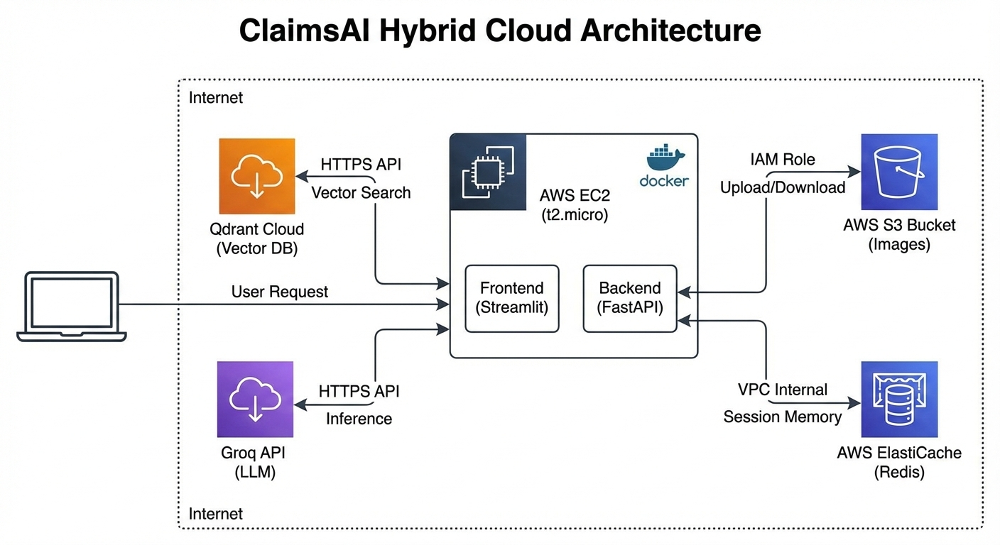

# ClaimsAI

**Auditoria de Sinistros com IA Multimodal e Arquitetura Híbrida AWS**

O ClaimsAI é uma plataforma de engenharia de dados e inteligência artificial projetada para automatizar a triagem de sinistros automotivos. O sistema atua como um assistente auditor que correlaciona evidências visuais (fotos do acidente) com regras contratuais (apólices em PDF), utilizando infraestrutura de nuvem otimizada para baixo custo e alta performance.



## Stack Tecnológica

* **Linguagem:** Python 3.10+
* **Backend:** FastAPI
* **Frontend:** Streamlit
* **LLM & Inferência:** Llama 3 (via Groq API)
* **Banco Vetorial:** Qdrant Cloud
* **Infraestrutura:** AWS (EC2, S3, ElastiCache)
* **Containerização:** Docker & Docker Compose

## Funcionalidades Principais

O sistema resolve o problema de falta de contexto em auditorias manuais através de três pilares:

1. **Análise Visual:** Processamento de imagens para identificação automática de danos e extensão do sinistro.
2. **Verificação Contratual:** Busca semântica em apólices para validação de coberturas, franquias e exclusões.
3. **Memória Persistente:** Gestão de estado da conversação utilizando Redis, permitindo auditorias contínuas e refinamento de contexto.

## Arquitetura e Engenharia

O projeto utiliza uma arquitetura híbrida focada em eficiência de recursos (Free Tier Optimization):

### 1. RAG Multimodal (Retrieval-Augmented Generation)
Implementação de pipelines que ingerem tanto texto quanto imagem. As imagens são armazenadas no **AWS S3** e indexadas no **Qdrant**, permitindo que o modelo recupere evidências visuais baseadas em consultas textuais.

### 2. Infraestrutura Centralizada (Fat Container)
Para otimização de custos, o núcleo da aplicação (Frontend e Backend) reside em uma instância **AWS EC2**, orquestrada via Docker.

### 3. Gestão de Estado Distribuída
Utilização do **AWS ElastiCache (Redis)** para manter o histórico de interações do usuário isolado do processamento principal, garantindo baixa latência na recuperação de contexto.

### 4. Busca Vetorial Avançada
Utilização de embeddings densos para captura de nuances semânticas nas cláusulas de seguros, superando limitações de buscas tradicionais por palavras-chave.

## Como Executar

### Pré-requisitos
* Docker e Docker Compose
* Conta AWS ativa (Configuração de credenciais IAM)
* Chaves de API (Groq, Qdrant)

### Instalação

```bash
# Clone o repositório
git clone [https://github.com/seu-usuario/claims-ai.git](https://github.com/seu-usuario/claims-ai.git)

# Configure as variáveis de ambiente
cp .env.example .env

# Inicie a infraestrutura
docker-compose up -d
